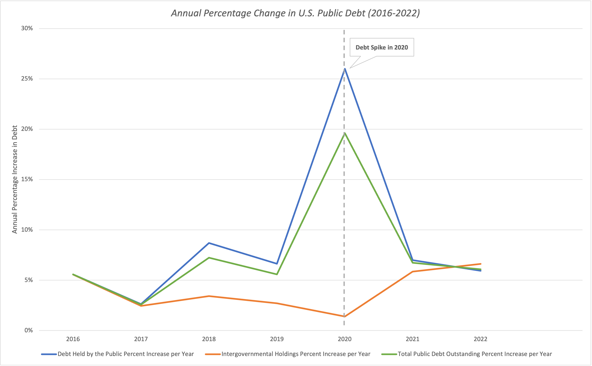

# US Debt Trends (1993-2023): Growth Analysis and Projections with Excel

## Table of Contents
- [Project Background](#project-background)
- [Data Structure & Initial Checks](#data-structure--initial-checks)
- [Executive Summary](#executive-summary)
- [Insights Deep Dive](#insights-deep-dive)
  - [Annual Percentage Increase in Debt](#annual-percentage-increase-in-debt)
  - [Monthly Debt Increase Trends](#monthly-debt-increase-trends)
  - [Projected Debt Growth](#projected-debt-growth)
- [Recommendations](#recommendations)
- [Assumptions and Caveats](#assumptions-and-caveats)

---

## Project Background
Managing public debt is essential to a nation's financial stability and long-term economic growth. I’m working with a small debt agency in Washington, DC, that specializes in analyzing and forecasting public and private debt. Our team has been asked by the U.S. Government to conduct a comprehensive review of public debt from 1993 to 2023, focusing on annual debt growth, seasonal borrowing trends, and future projections.

This analysis aims to answer the following key questions:
- **How much has debt increased each year compared to the previous year?**
- **Which months historically see the highest and lowest increases in total debt?**
- **What is the projected growth of publicly held debt in the next few years?**

To conduct this analysis, I used Excel to clean and structure the data, create pivot tables for trend analysis, and summarize key findings in a final output sheet with insights and visualizations.

The Excel workbooks used for data inspection and cleaning can be accessed here.

---

## Data Structure & Initial Checks

The dataset consists of three primary components:

- **Debt Held by the Public**: The portion of the US public debt held by individuals, corporations, foreign governments, and entities outside of the US government.
- **Intergovernmental Holdings**: The portion of the US public debt held by various US government agencies.
- **Total Public Debt Outstanding**: The sum of the debt held by the public and intergovernmental holdings.

### **Data Cleaning Steps:**
- Removed duplicate entries based on `Record Date`.
- Transposed data for better structuring and analysis.
- Properly formatted financial data for accounting consistency.

---

## Executive Summary
Total public debt has steadily increased, growing at an average annual rate of 5% from 2016 to 2019 before surging by over 20% in 2020 due to the economic impact of the COVID-19 pandemic. Since then, debt growth has returned to pre-pandemic levels, following a more stable trajectory. Historical patterns show that the highest increases in debt typically occur in January, February, November, and December, while the lowest growth rates are observed between April and July. Projections suggest that total public debt will reach approximately $33 trillion by 2027, growing at an estimated annual rate of 6.1%. However, economic factors such as inflation, fiscal policy, and broader market conditions may influence future debt trends, highlighting the need for continued monitoring and strategic financial planning.

---

## Insights Deep Dive
### **Annual Percentage Increase in Debt**
- From 2016 to 2019, total public debt grew by an average of 5.13% per year. Most of this increase came from Debt Held by the Public, which rose 5.63% annually, while Intergovernmental Holdings grew at a slower 3.82%. This suggests that external borrowing was the main driver of debt growth during this period.
- In 2020, total public debt saw a sharp 19.6% increase, largely due to a 25.99% jump in Debt Held by the Public, while Intergovernmental Holdings barely grew at 1.40%. This surge was a direct response to the COVID-19 pandemic, as the government issued stimulus packages and emergency funding that significantly increased borrowing.
- While debt growth slowed after 2020, it remained higher than pre-pandemic levels, averaging 6.42% annually (compared to 5.13% pre-pandemic). This suggests that debt accumulation has not fully returned to pre-pandemic trends, possibly due to continued federal spending and efforts to support economic recovery.

---

### **Monthly Debt Increase Trends**
- Debt tends to rise the most in January, November, and December, likely due to increased federal spending, and higher consumer activity during the holiday season.
- April through July tend to see the lowest increases in debt, which may be attributed to tax revenues reducing borrowing needs, and fewer major holidays driving debt growth.
- These patterns suggest that debt accumulation follows predictable fiscal cycles rather than occurring at random throughout the year.

---

### **Projected Debt Growth**
- Public debt has grown significantly over the past two decades, rising from $6 trillion in 2008 to $25 trillion in 2022. This increase reflects a combination of economic downturns, policy decisions, and rising government spending.
- If borrowing continues at the current pace, public debt is expected to hit $33 trillion by 2027. While the rate of growth is expected to slow, overall debt levels remain on an upward trajectory.
- Future debt growth is projected to settle between 5-7% per year, but factors like inflation, interest rate changes, and policy shifts could impact this outlook. Close monitoring of these variables will be key to understanding where debt levels are headed.

---

## Recommendations
Based on the findings above, I would recommend the following:
1. Developing a long-term debt strategy to manage borrowing more effectively and reduce financial risks.
2. Adjusting budget planning for seasonal debt fluctuations to ensure efficient allocation of resources throughout the year.
3. Tracking key economic indicators like inflation, unemployment, and GDP to anticipate their impact on debt levels.
4. Improving debt forecasting models by incorporating broader economic factors for more accurate projections.

---

## Assumptions and Caveats
Throughout the analysis, a few assumptions and caveats were noted:  
- Future debt projections assume no major economic disruptions, such as financial crises or significant policy changes, beyond 2023. Unexpected events could cause deviations from these forecasts.
- Debt Held by the Public and Total Public Debt Outstanding were initially reported annually from 1997 to 2001, then shifted to monthly reporting from 2002 to 2005, before transitioning to more frequent, often daily, reporting. These changes in reporting frequency may impact trend analysis, particularly in earlier years.

---
