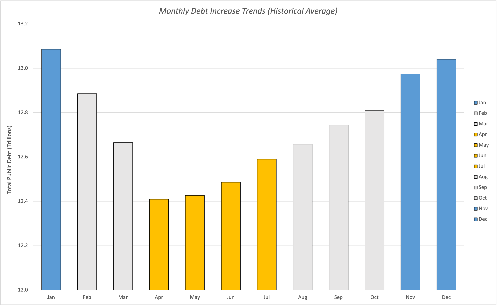
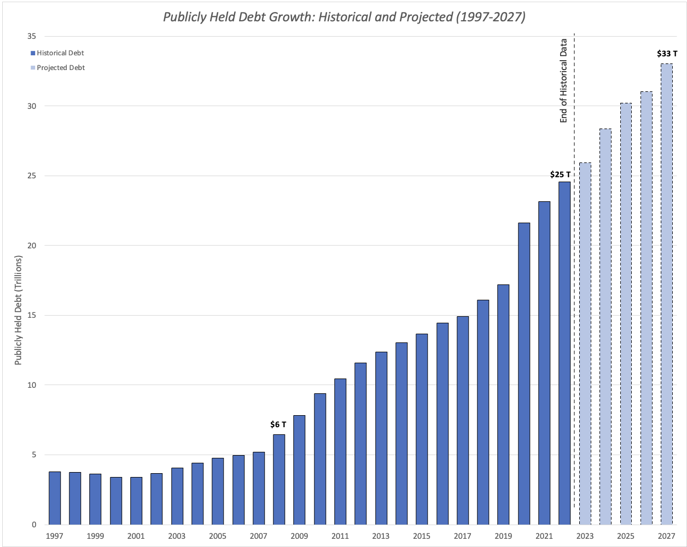
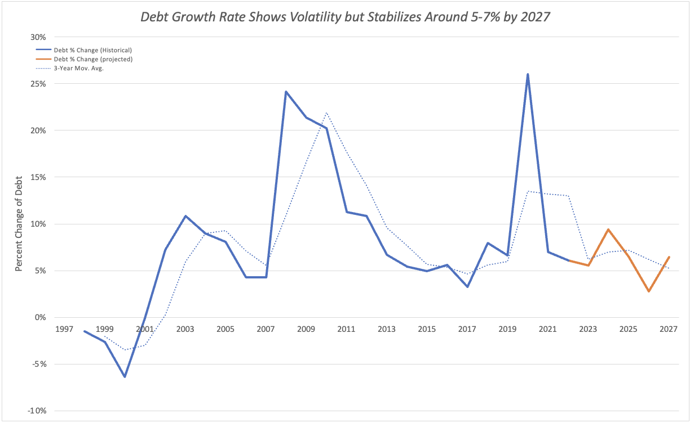

# Understanding U.S. Debt: 30 Years of Trends and What’s Ahead (1993-2023)

## Table of Contents
- [Project Background](#project-background)
- [Data Structure & Initial Checks](#data-structure--initial-checks)
- [Executive Summary](#executive-summary)
- [Insights Deep Dive](#insights-deep-dive)
  - [Annual Percentage Increase in Debt](#annual-percentage-increase-in-debt)
  - [Monthly Debt Increase Trends](#monthly-debt-increase-trends)
  - [Projected Debt Growth](#projected-debt-growth)
- [Recommendations](#recommendations)
- [Assumptions and Caveats](#assumptions-and-caveats)

---

## Project Background
Understanding how public debt has evolved over time is essential for financial planning and policy decisions. In this case study, I take on the role of a data analyst partnering with a small debt agency in Washington, DC, to examine public debt trends from 1993 to 2023. This analysis explores annual debt growth, seasonal borrowing patterns, and future projections, providing financial analysts and policymakers with data-driven insights for informed decision-making. The dataset used in this study is sourced from the U.S. Treasury's official website.

This analysis focuses on three key questions:
- **How much has debt increased each year compared to the previous year?**
- **Which months historically see the highest and lowest increases in total debt?**
- **What is the projected growth of publicly held debt in the next few years?**

The Excel workbook, which includes data cleaning and exploratory analysis, is available for review [here.](https://drive.google.com/file/d/16v4zOHwhJbtPXHAlBFplFogHmOhqQgi5/view?usp=sharing)

---

## Data Structure & Initial Checks
The dataset contains 7,495 records and includes four primary fields:
- `Record Date`: The date associated with each recorded debt value.
- `Debt Held by the Public`: The portion of the US public debt held by individuals, corporations, foreign governments, and entities outside of the US government.
- `Intergovernmental Holdings`: The portion of the US public debt held by various US government agencies.
- `Total Public Debt Outstanding`: The sum of the debt held by the public and intergovernmental holdings.

### **Data Cleaning Steps:**
- Removed duplicate entries based on `Record Date`.
- Transposed data for better structuring and analysis.
- Properly formatted financial data for accounting consistency.

---

## Executive Summary
U.S. public debt grew at an average of 5.13% annually from 2016 to 2019 before surging 19.6% in 2020. Growth has slowed since then but remains higher than pre-2020 levels. Debt tends to rise the most in January, November, and December, while April through July typically see slower increases. At the current pace, total public debt could reach $33 trillion by 2027, though factors like inflation, interest rates, and fiscal policy may impact this projection.

---

## Insights Deep Dive
### **Annual Percentage Increase in Debt**
- From 2016 to 2019, total public debt grew by an average of 5.13% per year. Most of this increase came from Debt Held by the Public, which rose 5.63% annually, while Intergovernmental Holdings grew at a slower 3.82%. This suggests that external borrowing was the main driver of debt growth during this period.
- In 2020, total public debt saw a sharp 19.6% increase, largely due to a 25.99% jump in Debt Held by the Public, while Intergovernmental Holdings barely grew at 1.40%. This surge was a direct response to the COVID-19 pandemic, as the government issued stimulus packages and emergency funding that significantly increased borrowing.
- While debt growth slowed after 2020, it remained higher than pre-pandemic levels, averaging 6.42% annually (compared to 5.13% pre-pandemic). This suggests that debt accumulation has not fully returned to pre-pandemic trends, possibly due to continued federal spending and efforts to support economic recovery.
  
    

---

### **Monthly Debt Increase Trends**
- Debt tends to rise the most in January, November, and December, likely due to increased federal spending, and higher consumer activity during the holiday season.
- April through July tend to see the lowest increases in debt, which may be attributed to tax revenues reducing borrowing needs, and fewer major holidays driving debt growth.
- These patterns suggest that debt accumulation follows predictable fiscal cycles rather than occurring at random throughout the year.
  
    
---

### **Projected Debt Growth**
- Public debt has grown significantly over the past two decades, rising from $6 trillion in 2008 to $25 trillion in 2022. This increase reflects a combination of economic downturns, policy decisions, and rising government spending.
- If borrowing continues at the current pace, public debt is expected to hit $33 trillion by 2027. While the rate of growth is expected to slow, overall debt levels remain on an upward trajectory.

    

- Future debt growth is projected to settle between 5-7% per year, but factors like inflation, interest rate changes, and policy shifts could impact this outlook. Close monitoring of these variables will be key to understanding where debt levels are headed.

  

---

## Recommendations
Based on the findings above, I would recommend the following:
1. Develop a long-term debt strategy by setting borrowing limits, prioritizing debt repayment, and adjusting policies to keep debt growth manageable.
2. Plan for seasonal debt fluctuations by preparing for high-borrowing periods in January, November, and December.
3. Monitor economic indicators like inflation, unemployment, and GDP to anticipate shifts in borrowing needs and adjust policies accordingly.
4. Improve debt forecasting by using historical trends and economic conditions to create more accurate projections.

---

## Assumptions and Caveats
Throughout the analysis, a few assumptions and caveats were noted:  
- Future debt projections assume no major economic disruptions, such as financial crises or significant policy changes, beyond 2023. Unexpected events could cause deviations from these forecasts.
- **Debt Held by the Public** and **Total Public Debt Outstanding** were initially reported annually from 1997 to 2001, then shifted to monthly reporting from 2002 to 2005, before transitioning to more frequent, often daily, reporting. These changes in reporting frequency may impact trend analysis, particularly in earlier years.

---
The Excel workbook used for data inspection and cleaning can be accessed [here](Exploration/US_Debt_Trends_Data_Cleaning_and_EDA.xlsx).

For more of my projects and data journey, visit my portfolio website and reach out!
